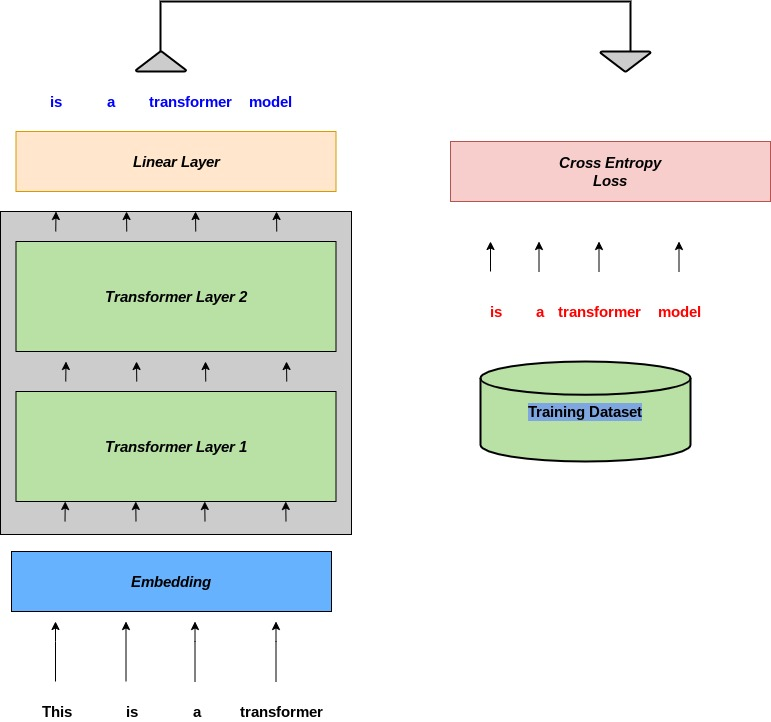

# TLT : Transformer-Lightning Language Model 




### Table of Contents

- **[Introduction](#Introduction)**
- **[Setup](#Setup)**
- [**Run the code**](#Run-the-code)
- **[Training](#Training)**
- **[Sample Generation](#Sample-Generation)**
- **[Play with the model](#Play-with-the-model)**
- **[Connect with me](#Connect-with-me)**
- **[License](#License)** 

### Introduction

This is an implementation of a transformer based language model using [Pytorch-Lightning framework](https://www.pytorchlightning.ai/). The model consists of two transformer layers with embedding and linear layers. 

### Setup

The code is using `pipenv` as a virtual environment and package manager. To run the code, all you need is to install the necessary dependencies. open the terminal and type:

- `$ git clone https://github.com/Khamies/Transformer_Lightning.git` 
- `$ cd Transformer_Lightnin`
- `$ pipenv install`

And you should be ready to go to play with code and build upon it!

### Run the code

- To train the model, run: `python main.py`

- To train the model with specific arguments, run: `python main.py --batch_size=64`. The following command-line arguments are available:
  - Train batch size: `--bsz_train`
  - Test batch size: `--bsz_test`
  - bptt: `--bptt`
  - Learning rate: `--lr`
  - Embedding size: `--embed_size`
  - Size of FeedForward Neural Network (1st layer): `--ffnn_size`
  - Attention Heads: `--nhead`
  - Transformer Layers: `--nlayers`

### Training

The model is trained on `10 epochs` using Adam as an optimizer with a `learning rate = 0.001` and `batch size = 32`, you can find all the model settings in [settings.py](https://github.com/Khamies/LSTM-Language-Generator/blob/main/settings.py). Here is the loss curve for the training step:

- **Negative Likelihood Loss**

  

### Sample Generation

Here are some generated samples from the model:

```markdown
he said <pad> is n't expected to be the first quarter of
the company said will be used to repay the company's
```

## Play with the model

To play with the model, a jupyter notebook has been provided, you can find it [here](https://github.com/Khamies/LSTM-Language-Generator/blob/main/Play_with_model.ipynb)

### Citation

> ```
> @misc{Khamies2021LSTM-Language-Generator,
> author = {Khamies, Waleed},
> title = {A PyTorch Implementation for an LSTM-based language model},
> year = {2021},
> publisher = {GitHub},
> journal = {GitHub repository},
> howpublished = {\url{https://github.com/Khamies/LSTM-Language-Generator}},
> }
> ```

### Connect with me :slightly_smiling_face:

For any question or a collaboration, drop me a message [here](mailto:khamiesw@outlook.com?subject=[GitHub]%20LSTM-Language-Generator%20Repo)

Follow me on [Linkedin](https://www.linkedin.com/in/khamiesw/)!

**Thank you :heart:**

### License 


